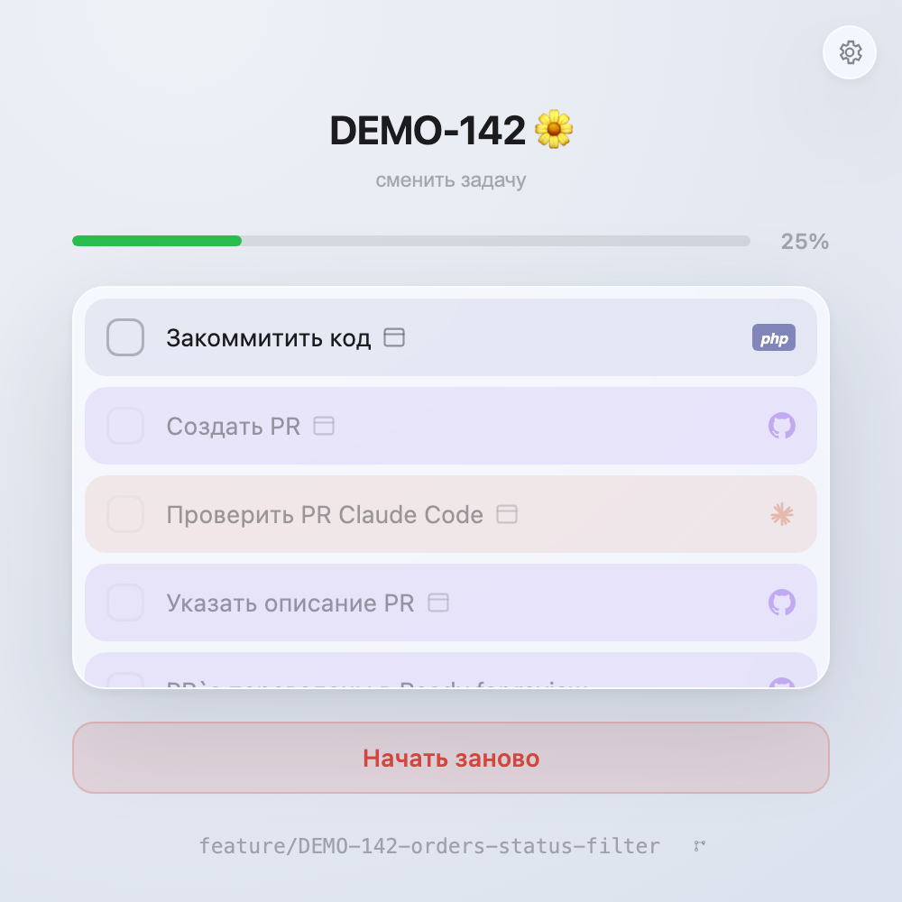
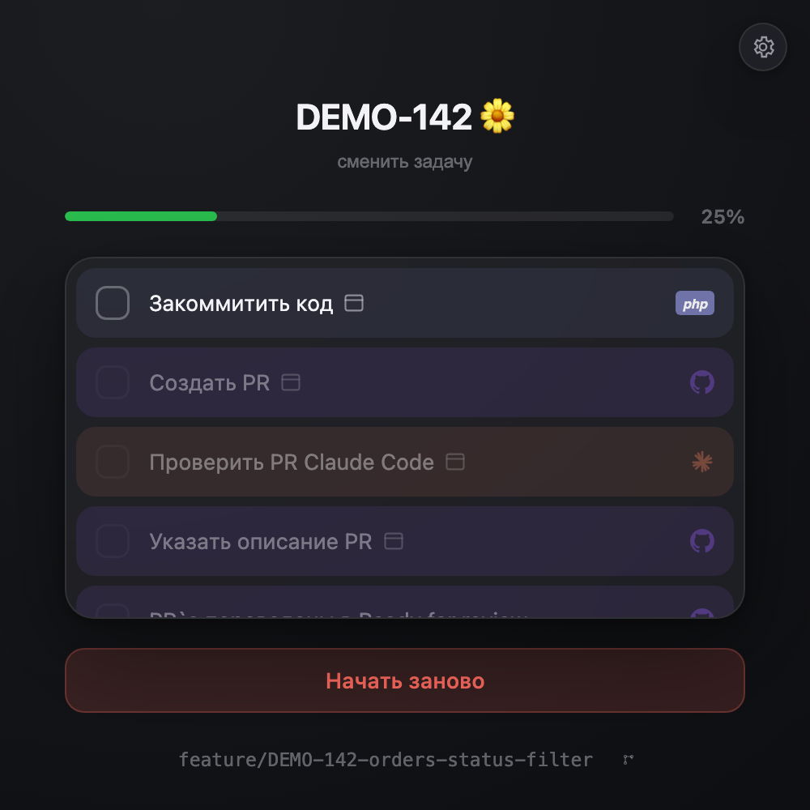

<div align="center">

# 🧭 DevFlow

### Персональный чек-лист рутины по задаче Jira

Вставил ссылку на задачу — приложение провело по всем шагам разработки:
Story Points → ветка → коммит → PR → ревью → Jira → трек времени → отправка PR ревьюверу.
Каждый шаг сам делает сопутствующее действие: копирует команду, генерирует имя ветки и
описание PR нейронкой, переводит статус в Jira, трекает время.


<table>
<tr>
<td></td>
<td></td>
</tr>
</table>

<sub>Приложение рассчитано на маленькое окно браузера <b>500×500</b> — держите его сбоку от IDE.</sub>

</div>

---

## Содержание

- [Что это и как работает](#что-это-и-как-работает)
- [Шаги чек-листа](#шаги-чек-листа)
- [Что нужно установить](#что-нужно-установить)
- [Быстрый старт за 5 минут](#быстрый-старт-за-5-минут)
- [Открыть в отдельном окне 500×500](#открыть-в-отдельном-окне-500500)
- [Конфигурация: `config/params.ini`](#конфигурация-configparamsini)
  - [1. Jira — `[atlassian]`](#1-jira--atlassian)
  - [2. Нейронка — `[llm]`](#2-нейронка--llm)
    - [Вариант А: Claude по API](#вариант-а-claude-по-api-проще)
    - [Вариант Б: LM Studio (локально, бесплатно)](#вариант-б-lm-studio-локально-бесплатно)
  - [3. GitHub CLI — `[github]`](#3-github-cli--github)
  - [4. Git-команды — `[git]`](#4-git-команды--git)
  - [5. Тексты команды — `[templates]` и `[docs]`](#5-тексты-команды--templates-и-docs)
  - [6. Рабочий день — `[worktime]`](#6-рабочий-день--worktime)
  - [7. Заработок — `[salary]`, `[currency]`, `[services]`](#7-заработок--salary-currency-services)
  - [8. Режим скилла Claude Code — `[mode]`](#8-режим-скилла-claude-code--mode)
- [Проверка, что всё поднялось](#проверка-что-всё-поднялось)
- [Что можно не настраивать](#что-можно-не-настраивать)
- [Траблшутинг](#траблшутинг)
- [Структура проекта](#структура-проекта)
- [Обновление и остановка](#обновление-и-остановка)

---

## Что это и как работает

Одностраничное приложение без фреймворков: PHP 8.3 + SQLite-файл, фронтенд — один `app.js`.
Ни Composer, ни npm, ни сборки, ни авторизации — это персональный инструмент на одного
человека, БД лежит рядом файлом.

1. Вставляете ссылку на задачу Jira (`https://your-domain.atlassian.net/browse/PROJ-123`).
2. Приложение проверяет, что задача существует, подтягивает её заголовок и описание из Jira
   и создаёт (или находит) чек-лист в своей БД.
3. Дальше идёте по пунктам сверху вниз: доступен всегда только первый невыполненный.
   Выполненный пункт уезжает из списка, прогресс-бар растёт.
4. Повторное открытие той же задачи **не сбрасывает** отметки — только обновляет данные из
   Jira. Сбросить чек-лист можно кнопкой «Начать заново», удалить задачу — из списка последних
   задач на экране ввода ссылки.

## Шаги чек-листа

| Шаг | Что делает приложение | Нужна интеграция |
|---|---|---|
| Указать Story Points | Модалка с выбором 1/2/3/5/8/13 → проставляет поле в Jira. Пункт скрыт, если Story Points в задаче уже стоят | Jira |
| Перевести в статус Doing | Переводит задачу в Jira в статус из конфига | Jira |
| Создать ветку в Git | Генерирует имя ветки нейронкой по заголовку задачи, копирует в буфер, сохраняет в БД | Нейронка (опц.) |
| Закоммитить код | Поле «что сделали» → нейронка собирает первую строку commit message по Conventional Commits с ключом задачи | Нейронка |
| Создать PR | Отдаёт готовую команду `gh pr create --draft` с вашими ревьюверами, спрашивает ссылку на созданный PR | GitHub CLI |
| Проверить PR Claude Code | Копирует готовый промпт ревью со ссылкой на PR и ссылками на вашу внутреннюю документацию | — |
| Указать описание PR | Нейронка заполняет шаблон описания PR команды + опциональный блок инструкции выливки | Нейронка |
| PR`s переведены в Ready for review | Просто отметка | — |
| Оставить описание в Jira | Копирует форматированный текст для комментария в Jira | — |
| Перевести задачу в Pull Request | Переводит задачу в Jira в статус из конфига | Jira |
| Затрекать время | Ползунок на весь рабочий день (с вычетом обеда) → добавляет worklog в Jira. При достижении дневной нормы — модалка поздравления с заработком за день и мотивационной цитатой | Jira |
| Отправить PR ревьюверу | Копирует ссылку на PR и шаблон сообщения с инструкцией выливки | — |

Плюс независимо от чек-листа: индикатор затреканного за сегодня времени, быстрый трек времени
одним ползунком, список сегодняшних задач, дропдаун git-команд у названия ветки
(`checkout -b`, `push`, `rebase` на ваши базовые ветки).

## Что нужно установить

Минимум, чтобы приложение открылось:

- **либо** Docker Desktop (рекомендуется — ничего больше ставить не нужно),
- **либо** PHP 8.3+ с расширением `pdo_sqlite` (`php -m | grep pdo_sqlite`).

Для отдельных функций дополнительно:

| Хочу | Нужно |
|---|---|
| Заголовок задачи из Jira, статусы, Story Points, трек времени | Аккаунт Atlassian + API-токен → [`[atlassian]`](#1-jira--atlassian) |
| Генерацию имени ветки / commit message / описания PR | Ключ Claude API **или** LM Studio на своей машине → [`[llm]`](#2-нейронка--llm) |
| Рабочую команду создания PR | GitHub CLI (`gh`) → [`[github]`](#3-github-cli--github) |

Ничего из этого не обязательно: без Jira и нейронки чек-лист всё равно работает — просто
соответствующие шаги не делают внешних действий (см. [«Что можно не настраивать»](#что-можно-не-настраивать)).

## Быстрый старт за 5 минут

```bash
git clone <адрес-репозитория> dev-flow
cd dev-flow
cp config/params.ini.example config/params.ini
```

Откройте `config/params.ini` и **обязательно отредактируйте либо удалите** секции с чужими
значениями-заглушками (`your-domain.atlassian.net`, `sk-ant-...`, `your-github-nickname`) —
с заглушками приложение запустится, но Jira будет отвечать ошибкой авторизации. Как заполнить
каждую секцию — в разделе [«Конфигурация»](#конфигурация-configparamsini). Можно начать вообще
с пустого файла и добавлять секции по мере надобности.

Запуск в Docker:

```bash
docker compose up -d --build
```

Или без Docker, локальным PHP (из корня проекта — важно, документ-рут именно корень, а не
`public/`):

```bash
php -S localhost:8000
```

Открывайте: **http://localhost:8000/public/index.php**

Файл БД (`storage/app.sqlite`) создастся сам при первом открытии, схема и список пунктов
чек-листа применятся автоматически — никаких миграций руками запускать не нужно.

## Открыть в отдельном окне 500×500

Приложение спроектировано под маленькое окно, которое всегда висит рядом с IDE. В Chrome:

1. Откройте http://localhost:8000/public/index.php
2. Меню ⋮ → **Cast, save and share** → **Install page as app** (в старых версиях:
   *More tools → Create shortcut* → галочка *Open as window*).
3. Получится отдельное окно без адресной строки — уменьшите его примерно до 500×500 и оставьте
   сбоку.

## Конфигурация: `config/params.ini`

Единственный файл настроек. В git не попадает (см. `.gitignore`) — в нём ваши токены и адреса.
Шаблон со всеми ключами и комментариями — `config/params.ini.example`.

```bash
cp config/params.ini.example config/params.ini
```

Формат — обычный INI: секции в квадратных скобках, значения в двойных кавычках.
**Все секции необязательны** — ненастроенная интеграция просто отключает свои функции, а не
роняет приложение. После правки файла в Docker перезапуск не нужен (конфиг читается на каждый
запрос), но если что-то не подхватилось — `docker compose restart`.

---

### 1. Jira — `[atlassian]`

Даёт: заголовок и описание задачи, проверку что задача существует, Story Points, переводы
статусов, трек времени, индикатор «затрекано сегодня», список сегодняшних задач.

```ini
[atlassian]
base_url = "https://your-domain.atlassian.net"
email = "you@example.com"
api_token = "ATATT3xFfGF0..."
story_points_field = "customfield_10016"
doing_status = "Doing"
pull_request_status = "Pull request"
```

**Где взять `api_token`** (это не пароль от аккаунта — пароль не подойдёт):

1. Зайдите на **https://id.atlassian.com/manage-profile/security/api-tokens** под своим
   аккаунтом Atlassian.
2. **Create API token** → введите любое имя (например `devflow`) → **Create**.
3. Скопируйте токен сразу — второй раз его не покажут. Вставьте в `api_token`.

**`base_url`** — адрес вашей Jira без пути: откройте любую задачу, в адресе будет
`https://ЧТО-ТО.atlassian.net/browse/PROJ-123` → в конфиг идёт `https://ЧТО-ТО.atlassian.net`.

**`email`** — почта того самого аккаунта Atlassian, на который выпущен токен (они работают
только в паре, Basic Auth).

**`story_points_field`** — ID кастомного поля Story Points, у разных Jira он разный.
По умолчанию `customfield_10016` (подходит большинству Jira Cloud). Проверить свой:

```bash
curl -s -u "you@example.com:ВАШ_ТОКЕН" "https://your-domain.atlassian.net/rest/api/2/field" | grep -i "story point"
```

В ответе будет что-то вида `"id":"customfield_10016","name":"Story Points"` — берите `id`.

**`doing_status` / `pull_request_status`** — названия переходов в вашем workflow, должны
совпадать буква-в-букву (регистр не важен, но пробелы и слова — важны). Посмотреть, какие
переходы реально доступны для задачи:

```bash
curl -s -u "you@example.com:ВАШ_ТОКЕН" \
  "https://your-domain.atlassian.net/rest/api/2/issue/PROJ-123/transitions" | python3 -m json.tool
```

Берите значения `transitions[].name` (или `.to.name`). По умолчанию — `Doing` и `Pull request`.

> Без секции `[atlassian]` приложение работает: задачи открываются без заголовка из Jira,
> а Jira-шаги чек-листа просто отмечаются без внешнего действия.

---

### 2. Нейронка — `[llm]`

Даёт: генерацию имени git-ветки, первой строки commit message, описания PR по шаблону
команды, блока инструкции выливки и перевод мотивационной цитаты.

Поддерживаются два провайдера, переключаются **одной строкой** `provider` — настройки обоих
лежат в секции одновременно, удалять ничего не нужно:

```ini
[llm]
provider = "anthropic"          ; "anthropic" или "lmstudio" (по умолчанию "lmstudio")

; --- провайдер anthropic ---
anthropic_api_key = "sk-ant-api03-..."
anthropic_model = "claude-haiku-4-5"

; --- провайдер lmstudio ---
lmstudio_host = "http://host.docker.internal:1234"
lmstudio_model = "qwen3.5-4b"
```

#### Вариант А: Claude по API (проще)

1. Зарегистрируйтесь на **https://platform.claude.com**.
2. **Settings → API keys → Create key**, скопируйте ключ (`sk-ant-api03-...`) — показывается
   один раз.
3. Пополните баланс в **Billing** (без баланса API отвечает ошибкой `credit balance is too low`).
4. В конфиг: `provider = "anthropic"`, `anthropic_api_key = "<ключ>"`.

`anthropic_model` можно не указывать — по умолчанию `claude-haiku-4-5`, самая дешёвая и
быстрая модель. Все тексты здесь короткие (строка ветки, строка коммита, описание PR), так что
расход на реальной работе — центы в месяц. SDK не нужен: запрос уходит обычным cURL.

#### Вариант Б: LM Studio (локально, бесплатно)

Полностью локальная нейронка на вашей машине — ни ключей, ни оплаты, ни утечки описаний задач
наружу. Приложение обращается к ней по протоколу `POST <host>/api/v1/chat` с телом
`{model, system_prompt, input}` — это встроенный REST API LM Studio, поэтому **нужен
LM Studio версии 0.4 или новее** (проверено на 0.4.21).

**Шаг 1. Установите LM Studio** — https://lmstudio.ai (macOS / Windows / Linux, бесплатно).

**Шаг 2. Скачайте модель.** Вкладка 🔍 **Discover** → поиск по названию → **Download**.
Задачи здесь простые (одна строка коммита, короткое описание), поэтому маленькой модели
хватает с запасом:

| Модель | Размер на диске | Кому |
|---|---|---|
| **Qwen3.5 4B** (`qwen3.5-4b`, квантование Q4_K_M / Q4_K_S) | ~2.5 ГБ | **рекомендуется**: быстрая, помещается в 8 ГБ RAM, хорошо держит русский и формат ответа |
| **Gemma 3 4B** (`google/gemma-3-4b`) | ~2.5 ГБ | альтернатива, если Qwen капризничает с форматом |
| **DeepSeek Coder V2 Lite Instruct** (`deepseek-coder-v2-lite-instruct`, Q4) | ~9 ГБ | если есть 16+ ГБ RAM и хочется более «программистских» формулировок |

Не берите модели крупнее 7–8B: выигрыш в качестве для двух строк текста незаметен, а ждать
генерацию будете секунды вместо мгновенного ответа.

**Шаг 3. Параметры загрузки модели** (панель загрузки, она же ⚙️ у модели):

| Параметр | Значение | Почему |
|---|---|---|
| Context Length | `4096` (можно `8192`) | описание PR — самый длинный ответ, 4k хватает; больше контекста = больше памяти |
| GPU Offload | максимум (все слои) | на Apple Silicon и дискретной видеокарте ускоряет в разы |
| Flash Attention | вкл. | меньше памяти, быстрее |
| Temperature | оставьте по умолчанию (~0.7) | форматом ответа управляют системные промпты приложения |
| Keep model in memory | вкл. | иначе первая генерация после паузы ждёт загрузку модели с диска |

**Шаг 4. Поднимите сервер.** Вкладка **Developer** (иконка `>_`) → переключатель **Status:
Running**. Порт по умолчанию — `1234`. Там же включите:

- **Just-in-Time model loading** — модель подгрузится сама на первый запрос;
- **Serve on Local Network** — **обязательно, если приложение запущено в Docker**: иначе сервер
  слушает только `localhost` самой машины, и контейнер до него не дотянется.

**Шаг 5. Пропишите адрес и модель:**

- запуск в **Docker** → `lmstudio_host = "http://host.docker.internal:1234"`
  (`localhost` изнутри контейнера — это сам контейнер, а не ваша машина);
- запуск через `php -S` → `lmstudio_host = "http://localhost:1234"`;
- `lmstudio_model` — **точный** id модели, как его отдаёт сервер (не название файла).
  Посмотреть список:

```bash
curl -s http://localhost:1234/v1/models
```

**Шаг 6. Проверьте, что нейронка отвечает** тем же запросом, что делает приложение:

```bash
curl -s http://localhost:1234/api/v1/chat -H 'Content-Type: application/json' -d '{"model":"qwen3.5-4b","system_prompt":"Отвечай одним словом","input":"Привет"}'
```

Ожидаемый ответ — JSON с `output[0].content`. Если пришёл `404` — проверьте, что сервер во
вкладке Developer в состоянии *Running* и что LM Studio не старее 0.4. Если
`Connection refused` из контейнера — не включён *Serve on Local Network*.

> Без настроенной секции `[llm]` кнопки «Сгенерировать» отвечают ошибкой, остальное приложение
> работает как обычно; в модалке поздравления цитата покажется на английском (нейронка там
> только переводчик).

---

### 3. GitHub CLI — `[github]`

Шаг «Создать PR» отдаёт в буфер готовую команду `gh pr create --draft ... --reviewer <ники>`.
Чтобы её было чем выполнить, поставьте и авторизуйте GitHub CLI:

```bash
brew install gh
gh auth login
```

(Windows/Linux и другие способы установки — https://cli.github.com)

```ini
[github]
reviewers = "octocat, hubot"
```

`reviewers` — GitHub-ники ревьюверов через запятую; ровно их приложение подставит в
`--reviewer`. Не задано — флаг просто не добавляется в команду.

---

### 4. Git-команды — `[git]`

Дропдаун у названия ветки внизу экрана: `Create Branch`, `Push` и пункты `Rebase …` под ваши
репозитории.

```ini
[git]
rebase_targets = "API3:main, Adminka:dev"
```

Формат — `Подпись:базовая-ветка` через запятую. Подпись видна в меню, базовая ветка уходит в
команду `git rebase origin/<база>`. Не задано — в дропдауне остаются только `Create Branch` и
`Push`.

---

### 5. Тексты команды — `[templates]` и `[docs]`

Куски копируемых текстов, которые у каждой команды свои:

```ini
[templates]
review_skip_migration_repos = "api_v3, adminka"
deploy_config_project = "апи3"

[docs]
php_code_style = "https://your-domain.atlassian.net/wiki/spaces/DevTeam/pages/000000001"
testing_standards = "https://your-domain.atlassian.net/wiki/spaces/DevTeam/pages/000000002"
api_data_format = "https://your-domain.atlassian.net/wiki/spaces/DevTeam/pages/000000003"
```

- `review_skip_migration_repos` — репозитории, где миграции не выполняются: промпт ревью
  попросит Claude их не проверять. Не задано — этот абзац в промпт не попадает.
- `deploy_config_project` — название проекта в строке «Добавить в конфиг …» шаблона выливки.
- `[docs]` — ссылки на вашу внутреннюю документацию (Confluence и т.п.), промпт ревью
  подставит их рядом с соответствующими пунктами. Каждый ключ необязателен: не задан — ссылки
  в промпте просто нет.

---

### 6. Рабочий день — `[worktime]`

Настраивает ползунок трека времени: его границы, обеденный перерыв и дневную норму часов.

```ini
[worktime]
start = "09:00"
end = "18:00"
daily_hours = 8
lunch_start = "12:00"
lunch_end = "13:00"
```

Необязательно — показаны значения по умолчанию. Позиция бегунка — это время, **до которого
отработан день**; обед подсвечен оранжевым и в трек не идёт. `daily_hours` — ещё и порог, при
достижении которого появляется модалка поздравления.

---

### 7. Заработок — `[salary]`, `[currency]`, `[services]`

Первый за день трек времени, доводящий сумму до `[worktime].daily_hours`, показывает модалку
поздравления: сколько заработано за день и мотивационная цитата.

```ini
[salary]
monthly_usd = 1500
working_days_per_month = 21

[currency]
code = "UAH"
label = "грн"

[services]
exchange_rate_url = "https://open.er-api.com/v6/latest/USD"
quotes_url = "https://zenquotes.io/api/random"
```

Всё необязательно — показаны значения по умолчанию. Часовая ставка =
`monthly_usd / (working_days_per_month × daily_hours)`, дальше сумма пересчитывается в валюту
`[currency].code` по курсу с `exchange_rate_url` (кэш на 6 часов в
`storage/exchange_rate_cache.json`). Сервисы курса и цитат — публичные, **ключи им не нужны**.
Не удалось получить курс — строка про заработок в модалке просто не показывается.

---

### 8. Режим скилла Claude Code — `[mode]`

Если коммит, PR, ревью и описание PR за вас делает скилл Claude Code, эти пункты в чек-листе
только мешают. Одним переключателем они скрываются, а вместо них появляется пункт
«Закоммитить изменения» с командой `/commit`:

```ini
[mode]
claude_code_skill_mode = "1"
```

`1` — скрыть `code_written`, `pull_request`, `claude_review`, `pr_description` и показать
`skill_commit`. `0`, отсутствующий ключ или отсутствующий `params.ini` — полный чек-лист.
**Отметки в БД не удаляются**: выключите режим — пункты вернутся с уже проставленными
галочками.

---

## Проверка, что всё поднялось

| Что проверяем | Как | Ожидаемо |
|---|---|---|
| Приложение | Открыть http://localhost:8000/public/index.php | Экран с полем «ссылка на задачу» |
| БД | `ls -la storage/app.sqlite` | Файл появился после первого открытия |
| Jira | Вставить ссылку на реальную задачу | Сверху появился ключ задачи, чек-лист отрисовался; слева вверху — индикатор затреканного времени |
| Jira (токен) | `curl -s -u "почта:токен" "https://ваш-домен.atlassian.net/rest/api/2/myself"` | JSON с вашим аккаунтом, а не `401` |
| Нейронка | Дойти до «Создать ветку в Git» → «Сгенерировать» | В поле подставилось имя ветки |
| GitHub CLI | `gh auth status` | `Logged in to github.com` |

Логи PHP при запуске в Docker: `docker compose logs -f app`.

## Что можно не настраивать

| Не настроено | Что перестанет работать | Что продолжит |
|---|---|---|
| `[atlassian]` | Заголовок задачи из Jira, Story Points, переводы статусов, трек времени, индикатор времени | Весь чек-лист как ручной трекер, ветки, копирование текстов |
| `[llm]` | Кнопки «Сгенерировать» (ветка, commit message, описание PR); цитата останется на английском | Всё остальное; тексты можно вписывать руками |
| `[github]` | Ревьюверы в команде `gh pr create` | Сама команда копируется |
| `[git]`, `[templates]`, `[docs]` | Пункты `Rebase …`, названия проектов и ссылки на документацию в копируемых текстах | Тексты копируются без этих кусков |
| `[worktime]`, `[salary]`, `[currency]`, `[services]` | Ничего — подставятся значения по умолчанию | Всё |
| Файл `params.ini` целиком | Все интеграции | Чек-лист, ветка, копирование текстов, прогресс |

## Траблшутинг

| Симптом | Причина и что делать |
|---|---|
| Белая страница / 404 при открытии | Сервер запущен не из корня проекта. Нужен `php -S localhost:8000` **из корня** и адрес `/public/index.php` — фронт ходит в API по относительному пути `../api/` |
| `could not find driver` | Нет расширения `pdo_sqlite`. Проверьте `php -m \| grep pdo_sqlite`; в Docker оно уже собрано |
| `unable to open database file` | Нет прав на запись в `storage/` → `chmod -R 775 storage` |
| «Не удалось распознать ссылку на задачу» | В ссылке нет ключа вида `PROJ-123`. Подойдёт `.../browse/PROJ-123`, `?selectedIssue=PROJ-123` или просто `PROJ-123` |
| «Задача не найдена в Jira» | Опечатка в ключе, либо у аккаунта нет доступа к проекту. Недоступность самой Jira задачу не блокирует |
| Jira отвечает `401` | Неверная пара `email` + `api_token`, либо в `api_token` вписан пароль от аккаунта вместо токена |
| Story Points не проставляются | Не тот `story_points_field` — найдите свой через `/rest/api/2/field` (см. выше) |
| Перевод статуса падает | Название в `doing_status` / `pull_request_status` не совпадает с переходом в workflow — сверьте через `/rest/api/2/issue/PROJ-123/transitions` |
| Кнопка «Сгенерировать» отвечает ошибкой | Провайдер в `[llm]` не настроен, либо LM Studio не запущен / указан не тот `lmstudio_model` |
| Нейронка: `Connection refused` из Docker | В `lmstudio_host` стоит `localhost` вместо `host.docker.internal`, либо в LM Studio выключен *Serve on Local Network* |
| Нейронка: `404` от LM Studio | Сервер во вкладке Developer не в состоянии *Running*, либо версия LM Studio старее 0.4 (нет `/api/v1/chat`) |
| Claude: `credit balance is too low` | Пустой баланс на platform.claude.com → Billing |
| Правки в коде не видны | Жёсткое кэширование браузером. Статика версионируется по mtime автоматически; при запуске в Docker после правки — `docker compose restart` |
| Затреканное только что время не видно в списке | Индекс поиска Jira Cloud обновляется с задержкой — приложение дозапрашивает открытую задачу напрямую, остальные подтянутся через несколько секунд |

## Структура проекта

```
config/params.ini          — единственный файл настроек (не в git, см. params.ini.example)
database/schema.sql        — схема SQLite (tasks, checklist, task_checklist)
storage/                   — создаётся сам: app.sqlite + кэш курса валют (не в git)
src/                       — классы App\*: Database, Config, репозитории, сервисы,
                             клиенты Jira / нейронок / курса валют / цитат
api/                       — JSON-эндпоинты (POST, JSON-in/JSON-out), тонкий слой над сервисами
public/index.php           — единственная HTML-страница
public/assets/css/style.css — стили (светлая/тёмная тема, glass в духе macOS)
public/assets/js/app.js    — вся клиентская логика (один файл, без сборки)
docs/                      — скриншоты для этого README
Dockerfile, docker-compose.yml — контейнерный запуск (PHP 8.3 + pdo_sqlite)
```

Полное описание архитектуры, бизнес-правил, каждого эндпоинта и поведения каждого пункта
чек-листа — в [`CLAUDE.md`](CLAUDE.md).

## Обновление и остановка

```bash
git pull                       # обновить код
docker compose restart         # подхватить правки (проект смонтирован как volume)
docker compose up -d --build   # нужно только если менялся Dockerfile
docker compose down            # остановить
```

Схема БД и список пунктов чек-листа приводятся к актуальному виду автоматически при первом
запросе после обновления — ничего запускать руками не нужно. Файл `storage/app.sqlite` при
обновлениях не трогается: отметки и задачи сохраняются.
